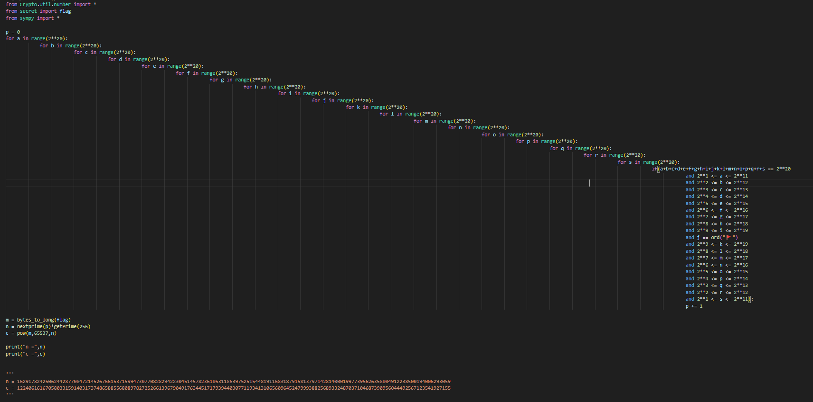

## flag

+ Difficulty：Middle
+ Solved：7

<br/>

## Description

It seems there are three flags in the task , Your mission is to find the third one.

<br/>

## Solution

It looks like a 'just simply run the program and get the result' challenge. However, since each loop iteration has a complexity of $2^{20}$ and there are too many iterations, the time cost of directly running the program would be astronomical. Therefore, other methods need to be considered.

The essence of this problem is actually 'finding non-negative integer solutions to a constrained linear equation'. The simplest approach is to use **Generating functions** to help solve it. Next, a toy example will be used to demonstrate this process:

```python
from Crypto.Util.number import *
from sympy import *

p = 0
for a in range(2**5):
    for b in range(2**5):
        for c in range(2**5):
            for d in range(2**5):
                for e in range(2**5):
                    if(a+b+c+d+e == 2**5
                        and 2**0 <= a <= 2**1
                        and 2**1 <= b <= 2**2
                        and 2**2 <= c <= 2**3
                        and 2**1 <= d <= 2**4
                        and 2**2 <= e <= 2**5):
                        p += 1

print(p)
```

For this example, the number of iterations and the complexity are significantly reduced, so it is indeed possible to simply run the program once to get $p = 445$. The next step is to figure out how to use Generating functions to obtain the same result.

We can treat each constraint as an equivalent polynomial, that is:
$$
2^0 \leq a \leq 2^1 \quad \leftrightarrow \quad (x^1 + x^2)
$$

$$
2^1 \leq b \leq 2^2 \quad \leftrightarrow \quad (x^2 + x^3 + x^4)
$$

$$
2^2 \leq c \leq 2^3 \quad \leftrightarrow \quad (x^4 + x^5 + x^6 + x^7 + x^8)
$$

$$
2^1 \leq d \leq 2^4 \quad \leftrightarrow \quad (x^2 + x^3 + ... + x^{15} + x^{16})
$$

$$
2^2 \leq e \leq 2^5 \quad \leftrightarrow \quad (x^4 + x^5 + ... + x^{31} + x^{32})
$$

Just simply multiply all the equivalent polynomials together and expand them,then the coefficient of the $x^{32}$ term is what we're looking for . Here is a simple Sage script:

```python
from Crypto.Util.number import *

def gen_poly(min_bound,max_bound):
    f = 0
    for i in range(min_bound,max_bound+1):
        f += x^i
    return f

PR.<x> = PolynomialRing(ZZ)
fa = gen_poly(2**0,2**1)
fb = gen_poly(2**1,2**2)
fc = gen_poly(2**2,2**3)
fd = gen_poly(2**1,2**4)
fe = gen_poly(2**2,2**5)
f = fa*fb*fc*fd*fe

p = f.monomial_coefficient(x^(2**5))
print(p)
```

We obtained the same result $p=445$. 

Then, just apply this approach to the challenge. Without any possible optimizations, this method takes about 10 minutes.

## Exp

get p:

```python
from Crypto.Util.number import *

def gen_poly(min_bound,max_bound):
    f = 0
    for i in range(min_bound,max_bound+1):
        f += x^i
    return f

PR.<x> = PolynomialRing(ZZ)
f = 1
for i in range(1,10):
    tt = gen_poly(2**(i),2**(i+10))
    f *= tt^2

p = f.monomial_coefficient(x^(2**20-ord("🚩")))
print(p)

#2565991931871938384822588623964880023351125901093463977291141641724850219374
```

get flag:

```python
from Crypto.Util.number import *
from sympy import *

n = 162917824250624428770847214526766153715994730770828294223045145782361053118639752515448191168318791581379714281400019977395626358004912238500194006293059
c = 122406161670580331591403173748658855680897827252661396790491763445171793944030771193413106560964524799938825689332487037104687390956044492567123541927155

p = nextprime(2565991931871938384822588623964880023351125901093463977291141641724850219374)
q = n // p
print(long_to_bytes(pow(c,inverse(65537,(p-1)*(q-1)),n)))

#R3CTF{Oh_Y0u_Found_th3_L4st_fl@g_4nd_H@v3_FUN!}
```

## Something else

According to the description:

> It seems there are three flags in the task , Your mission is to find the third one.

Now we know the third one is the one you need to submit to get the score, while the other two are:

+ the constraint of j:

  ```
  j == ord("🚩")
  ```

+ By zooming out the entire program view, you can see a flag rotated 90 degrees . This is why the ``itertools ``was not used and so many layers of loops instead XD:

  

